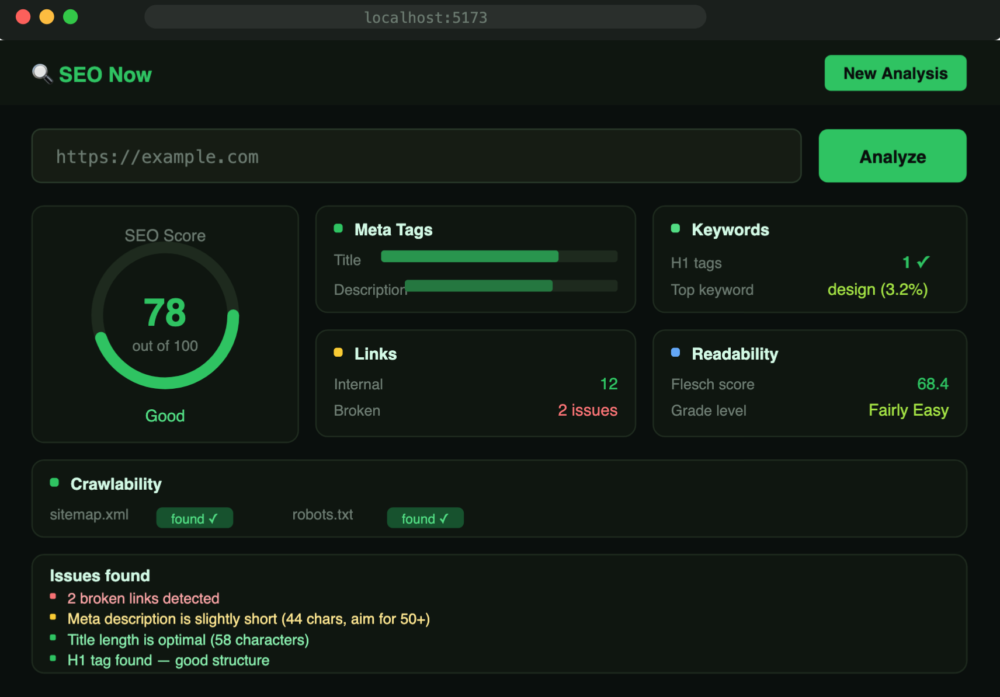

# 🔍 SEO Now Tool — On-Page Analyzer

> **Portfolio Project** | A full-stack on-page SEO audit tool built with FastAPI and React.  
> Analyze any public URL for meta tags, keyword density, readability, link health, and crawlability — in seconds.


---

## 📸 App Preview




---

## 🧭 Overview

SEO Now Tool is a lightweight, self-hosted SEO auditing application. Paste any public URL and receive an instant breakdown of:

- **Meta Tags** — title length, meta description, Open Graph tags, canonical URL
- **Keywords** — heading structure (H1–H3), top keyword frequency and density
- **Link Audit** — internal vs. external link counts, broken link detection.
---

## 🧪 Case Study

### Problem

Running a proper on-page SEO audit is harder than it should be. Developers and content creators
are often stuck choosing between manually digging through page source code or signing up for
costly tools with features they'll never use. There was no simple, fast, self-hostable option
that just works — no account required, no paywalls, no bloat.

### Solution

Build a focused, fast, self-hosted on-page audit tool that runs locally with no external API keys
required. The tool fetches a page, parses its HTML, and runs five independent analyses in parallel,
returning results in a clean, scored dashboard.


### Outcomes

- All five analyses run in parallel — full audit completes in ~2–4 seconds
- Modular architecture: each analysis is an independent FastAPI router
- Score algorithm is deterministic and documented, making it easy to extend
- Dark-mode-first UI designed for developer portfolios

---

## 🗂️ File & Folder Structure

```
seo-now-tool/
├── backend/                        # FastAPI Python backend
│   ├── main.py                     # App
│   ├── requirements.txt            # Python dependencies
│   ├── .env.example                # Environment variable template
│   ├── api/                        # One router file per analysis module
audit + broken link check
│   │   ├── readability.py          # Flesch / readability scoring
│   │   └── sitemap.py              # Sitemap 
│           └── score.js            # Client-side score calculator
│
├── docs/
│   ├── image1.png                  # Results dashboard screenshot
│   └── image2.png                  # Homepage screenshot
├── .gitignore
├── LICENSE
└── README.md
```

## 🚀 Getting Started

### Prerequisites

- Python 3.11+
- Node.js 18+
- macOS (tested), Linux, or Windows WSL

### 1 — Clone the repository

```bash
git clone https://github.com/Marjory00/seo-now-tool.git
cd seo-now-tool
```

### 2 — Set up the backend

```bash
cd backend

# Create and activate a virtual environment
python3.11 -m venv venv
source venv/bin/activate

# Install Python dependencies
pip install -r requirements.txt

# Start the FastAPI server
uvicorn main:app --reload --port 8000
```

The API will be live at `http://localhost:8000`.  
Interactive docs available at `http://localhost:8000/docs`.

### 3 — Set up the frontend

Open a new terminal tab:

```bash
cd frontend

# Install npm packages
npm install

# Start the Vite dev server
npm run dev
```

The app will be live at `http://localhost:5173`.

---

## 🛠️ VS Code Setup

Recommended extensions for this project:

- **Python** (Microsoft)
- **Pylance**
- **ES7+ React/Redux/React-Native snippets**
- **Tailwind CSS IntelliSense**
- **REST Client**

Recommended workspace settings (`.vscode/settings.json`):

```json
{
  "editor.formatOnSave": true,
  "python.defaultInterpreterPath": "./backend/venv/bin/python",
  "editor.tabSize": 2
}
```

## 📜 License

Copyright (c) 2024 **Marjory D. Marquez**. All Rights Reserved.

This project is published as part of a personal portfolio. It is **not open source**.  
You may view and study the code, but you may **not** use, distribute, or deploy it
commercially without explicit written permission from the author.

See [LICENSE](./LICENSE) for full terms.

---

## 👤 Author

**Marjory D. Marquez**

- 🌐 GitHub: [@Marjory00](https://github.com/Marjory00)
- 🎨 CodePen: [@Marjory00](https://codepen.io/Marjory00)
---

*Built with ☕ and Python on macOS.*
